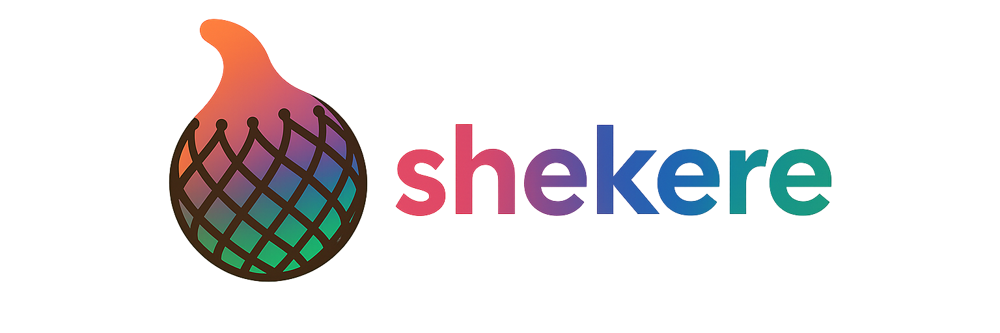

# Shekere

<div align="center">
  
</div>

shekere is a real-time shader art framework that combines WGSL shaders with sound input. It supports mouse interaction, OSC control (TidalCycles, etc.), and audio spectrum analysis.

## Features

### 🎨 **Shader Support**
- **Fragment Shaders**: Real-time WGSL fragment shader execution
- **Multi-pass Rendering**: Complex effects with multiple rendering passes
  - **Sequential Passes**: Chain multiple shaders for layered effects
  - **Ping-pong Buffers**: Double-buffered textures for iterative algorithms
  - **Persistent Textures**: State preservation across frames
- **Hot Reload**: Live shader editing with automatic recompilation

### 🎵 **Audio Integration**
- **Spectrum Analysis**: Real-time FFT analysis of audio input
- **OSC Support**: Integration with TidalCycles and other OSC sources
- **MIDI Control**: Real-time MIDI input for interactive control

### 🛠️ **Development**
- **TOML Configuration**: Simple, human-readable project configuration
- **Built-in Uniforms**: Time, window, mouse, audio data automatically available
- **Helper Functions**: Color space conversion, coordinate helpers, audio accessors

## Installation

### Install from Cargo

```bash
cargo install shekere
```

### Download Binary

Download binaries from [Releases](https://github.com/katk3n/shekere/releases).

## Basic Usage

```bash
shekere <config_file>
```

### Example:

```bash
shekere examples/basic/basic.toml
```

## Getting Started

1. Create a TOML config file with window settings and shader path
2. Write a fragment shader using the built-in uniforms and helpers
3. Run with `shekere config.toml`

## Documentation

For detailed documentation, see:

- **[Development Guide](docs/guide.md)** - Configuration, shader development, and examples
- **[API Reference](docs/api-reference.md)** - Complete reference for uniforms and helper functions

## Sample Projects

The included examples directory contains the following samples:

### Basic Examples
- `examples/basic/`: Basic time-based animation
- `examples/circular/`: Circular pattern with concentric rings
- `examples/mouse/`: Mouse-controlled shader art

### Audio Integration
- `examples/spectrum/`: Audio spectrum analysis visualizer
- `examples/osc/`: TidalCycles integration shader art
- `examples/midi/`: MIDI-controlled shader art

### Advanced Multi-pass Shaders
- `examples/multi_pass/`: Multi-pass rendering with blur effects
- `examples/persistent/`: Persistent texture effects and trail rendering
- `examples/ping_pong/`: Ping-pong buffer simulation and kaleidoscope effects

Use these as reference to create your own shader art projects.